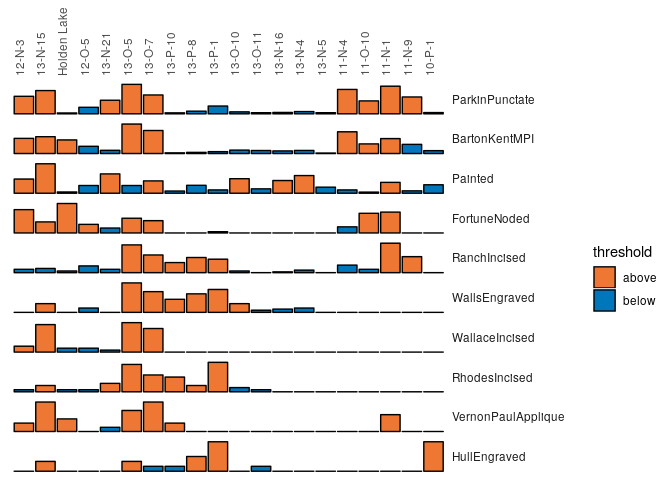
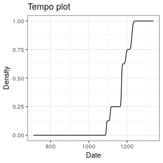
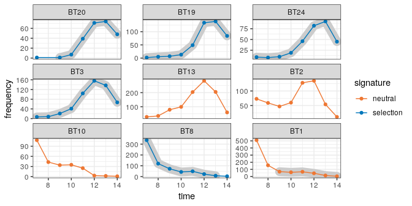

<!-- README.md is generated from README.Rmd. Please edit that file -->

# tabula 

[](https://ci.appveyor.com/project/nfrerebeau/tabula/branch/master)
[](https://travis-ci.org/nfrerebeau/tabula)
[](https://codecov.io/gh/nfrerebeau/tabula)

[](https://cran.r-project.org/package=tabula)
[](https://cran.r-project.org/web/checks/check_results_tabula.html)
[](https://cran.r-project.org/package=tabula)

[](https://www.repostatus.org/#active)
[](https://www.tidyverse.org/lifecycle/#stable)

[](https://doi.org/10.5281/zenodo.1489944)

## Overview

An easy way to examine archaeological count data. This package provides
a convenient and reproducible toolkit for relative and absolute dating
and analysis of (chronological) patterns. It includes functions for
matrix seriation (reciprocal ranking, CA-based seriation), chronological
modeling and dating of archaeological assemblages and/or objects. Beyond
these, the package provides several tests and measures of diversity:
heterogeneity and evenness (Brillouin, Shannon, Simpson, etc.), richness
and rarefaction (Chao1, Chao2, ACE, ICE, etc.), turnover and similarity
(Brainerd-Robinson, etc.). The package make it easy to visualize count
data and statistical thresholds: rank vs. abundance plots, heatmaps,
Ford (1962) and Bertin (1977) diagrams.

## Installation

You can install the released version of `tabula` from
[CRAN](https://CRAN.R-project.org) with:

``` r
install.packages("tabula")
```

Or install the development version from GitHub with:

``` r
# install.packages("devtools")
remotes::install_github("nfrerebeau/tabula")
```

## Usage

``` r
# Load packages
library(tabula)
library(magrittr)
```

`tabula` provides a set of S4 classes that extend the basic `matrix`
data type. These new classes represent different special types of
matrix.

  - Abundance matrix:
      - `CountMatrix` represents count data,
      - `FrequencyMatrix` represents relative frequency data.
  - Logical matrix:
      - `IncidenceMatrix` represents presence/absence data.
  - Other numeric matrix:
      - `OccurrenceMatrix` represents a co-occurrence matrix.
      - `SimilarityMatrix` represents a (dis)similarity matrix.

*It assumes that you keep your data tidy*: each variable (type/taxa)
must be saved in its own column and each observation (sample/case) must
be saved in its own row.

These new classes are of simple use, on the same way as the base
`matrix`:

``` r
# Define a count data matrix
quanti <- CountMatrix(data = sample(0:10, 100, TRUE),
                      nrow = 10, ncol = 10)

# Define a logical matrix
# Data will be coerced with as.logical()
quali <- IncidenceMatrix(data = sample(0:1, 100, TRUE),
                         nrow = 10, ncol = 10)
```

`tabula` uses coercing mechanisms (with validation methods) for data
type conversions:

``` r
## Create a count matrix
A1 <- CountMatrix(data = sample(0:10, 100, TRUE),
                  nrow = 10, ncol = 10)

## Coerce counts to frequencies
B <- as_frequency(A1)

## Row sums are internally stored before coercing to a frequency matrix
## (use totals() to get these values)
## This allows to restore the source data
A2 <- as_count(B)
all(A1 == A2)
#> [1] TRUE

## Coerce to presence/absence
C <- as_incidence(A1)

## Coerce to a co-occurrence matrix
D <- as_occurrence(A1)
```

Several types of graphs are available in `tabula` which uses `ggplot2`
for plotting informations. This makes it easy to customize diagrams
(e.g. using themes and scales).

Spot matrix\[1\] allows direct examination of data:

``` r
# Plot co-occurrence of types
# (i.e. how many times (percent) each pairs of taxa occur together 
# in at least one sample.)
mississippi %>%
  as_occurrence() %>%
  plot_spot() +
  ggplot2::labs(size = "", colour = "Co-occurrence") +
  ggplot2::theme(legend.box = "horizontal") +
  khroma::scale_colour_YlOrBr()
```


Bertin or Ford (battleship curve) diagrams can be plotted, with
statistic threshold (including B. Desachy’s
[sériographe](https://doi.org/10.3406/pica.2004.2396)).

``` r
mississippi %>%
  as_count() %>%
  plot_bertin(threshold = mean) +
  khroma::scale_fill_vibrant()
```



``` r
compiegne %>%
  as_count() %>%
  plot_ford()
```


### Seriation

``` r
# Build an incidence matrix with random data
set.seed(12345)
incidence <- IncidenceMatrix(data = sample(0:1, 400, TRUE, c(0.6, 0.4)),
                             nrow = 20)

# Get seriation order on rows and columns
# Correspondance analysis-based seriation
(indices <- seriate_reciprocal(incidence, margin = c(1, 2)))
#> Permutation order for matrix seriation: 
#>    Matrix ID: 7ff145b5-32f6-4f16-a298-37c6eb6a46a9 
#>    Row order: 1 4 20 3 9 16 19 10 13 2 11 7 17 5 6 18 14 15 8 12 
#>    Column order: 1 16 9 4 8 14 3 20 13 2 6 18 7 17 5 11 19 12 15 10 
#>    Method: reciprocal

# Permute matrix rows and columns
incidence2 <- permute(incidence, indices)
```

``` r
# Plot matrix
plot_heatmap(incidence) + 
  ggplot2::labs(title = "Original matrix") +
  ggplot2::scale_fill_manual(values = c("TRUE" = "black", "FALSE" = "white"))
plot_heatmap(incidence2) + 
  ggplot2::labs(title = "Rearranged matrix") +
  ggplot2::scale_fill_manual(values = c("TRUE" = "black", "FALSE" = "white"))
```


### Dating

This package provides an implementation of the chronological modeling
method developed by Bellanger and Husi
([2012](https://doi.org/10.1016/j.jas.2011.06.031)). This method is
slightly modified here and allows the construction of different
probability density curves of archaeological assemblage dates (*event*,
*activity* and *tempo*). Note that this implementation is experimental
(see `help(date_event)`).

``` r
# Coerce dataset to abundance (count) matrix
zuni_counts <- as_count(zuni)
# Assume that some assemblages are reliably dated (this is NOT a real example)
# The names of the vector entries must match the names of the assemblages
set_dates(zuni_counts) <- c(
  LZ0569 = 1097, LZ0279 = 1119, CS16 = 1328, LZ0066 = 1111,
  LZ0852 = 1216, LZ1209 = 1251, CS144 = 1262, LZ0563 = 1206,
  LZ0329 = 1076, LZ0005Q = 859, LZ0322 = 1109, LZ0067 = 863,
  LZ0578 = 1180, LZ0227 = 1104, LZ0610 = 1074
)

# Model the event date for each assemblage
model <- date_event(zuni_counts, cutoff = 90)
# Plot activity and tempo distributions
plot_date(model, type = "activity", select = "LZ1105") +
  ggplot2::labs(title = "Activity plot") +
  ggplot2::theme_bw()
plot_date(model, type = "tempo", select = "LZ1105") +
  ggplot2::labs(title = "Tempo plot") +
  ggplot2::theme_bw()
```



### Analysis

*Diversity* can be measured according to several indices (sometimes
referred to as indices of *heterogeneity*):

``` r
mississippi %>%
  as_count() %>%
  diversity(simplify = TRUE) %>%
  head()
#>            berger brillouin  mcintosh   shannon   simpson
#> 10-P-1  0.4052288 1.1572676 0.4714431 1.2027955 0.3166495
#> 11-N-9  0.6965699 0.7541207 0.2650711 0.7646565 0.5537760
#> 11-N-1  0.6638526 0.9192403 0.2975381 0.9293974 0.5047209
#> 11-O-10 0.6332288 0.8085445 0.2990830 0.8228576 0.5072514
#> 11-N-4  0.6034755 0.7823396 0.2997089 0.7901428 0.5018826
#> 13-N-5  0.4430380 0.9442803 0.4229570 0.9998430 0.3823434

## Test difference in Shannon diversity between assemblages
## (returns a matrix of adjusted p values)
mississippi[1:5, ] %>%
  as_count() %>%
  test_diversity()
#>               10-P-1       11-N-9       11-N-1   11-O-10
#> 11-N-9  0.000000e+00           NA           NA        NA
#> 11-N-1  3.609626e-08 8.538298e-05           NA        NA
#> 11-O-10 2.415845e-13 4.735511e-01 2.860461e-02        NA
#> 11-N-4  0.000000e+00 7.116363e-01 7.961107e-05 0.7116363
```

Note that `berger`, `mcintosh` and `simpson` methods return a
*dominance* index, not the reciprocal form usually adopted, so that an
increase in the value of the index accompanies a decrease in diversity.

Corresponding *evenness* (i.e. a measure of how evenly individuals are
distributed across the sample) can also be computed, as well as
*richness* and *rarefaction*.

Several methods can be used to ascertain the degree of *turnover* in
taxa composition along a gradient on qualitative (presence/absence)
data. It assumes that the order of the matrix rows (from *1* to *n*)
follows the progression along the gradient/transect.

Diversity can also be measured by addressing *similarity* between pairs
of sites:

``` r
## Calculate the Brainerd-Robinson index
## Plot the similarity matrix
mississippi %>%
  as_count() %>%
  similarity(method = "brainerd") %>%
  plot_spot() +
  ggplot2::labs(size = "Similarity", colour = "Similarity") +
  khroma::scale_colour_iridescent()
```


The Frequency Increment Test can be used to assess the detection and
quantification of selective processes in the archaeological
record\[2\].

``` r
## Keep only decoration types that have a maximum frequency of at least 50
keep <- apply(X = merzbach, MARGIN = 2, FUN = function(x) max(x) >= 50)
merzbach_count <- as_count(merzbach[, keep])

## The data are grouped by phase
## We use the row names as time coordinates (roman numerals)
set_dates(merzbach_count) <- rownames(merzbach)
## Plot time vs abundance and highlight selection
plot_time(merzbach_count, highlight = "FIT", roll = TRUE) +
  ggplot2::theme_bw() +
  khroma::scale_color_contrast()
```



## Contributing

Please note that the `tabula` project is released with a [Contributor
Code of
Conduct](https://github.com/nfrerebeau/tabula/blob/master/.github/CODE_OF_CONDUCT.md).
By contributing to this project, you agree to abide by its terms.

1.  Adapted from Dan Gopstein’s original
    [idea](https://dgopstein.github.io/articles/spot-matrix/).

2.  Adapted from Ben Marwick’s original
    [idea](https://github.com/benmarwick/signatselect/).
