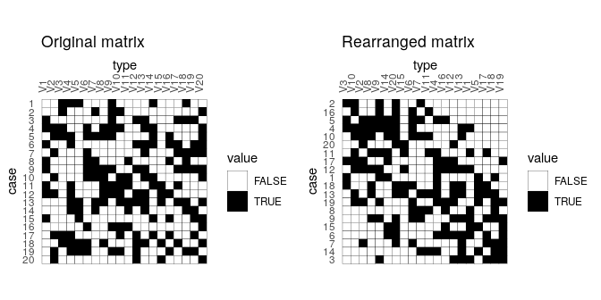
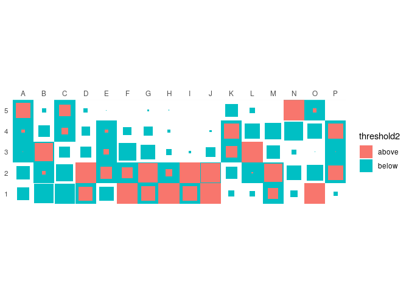
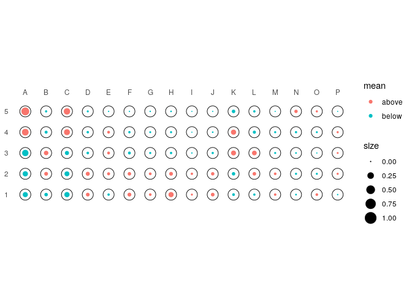
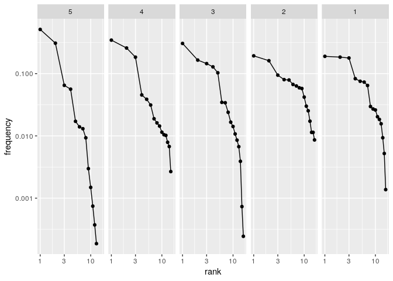

<!-- README.md is generated from README.Rmd. Please edit that file -->
tabula 
===================================================================

[](https://travis-ci.org/nfrerebeau/tabula) [](https://cran.r-project.org/package=tabula) [](https://www.tidyverse.org/lifecycle/#experimental) [](https://doi.org/10.5281/zenodo.1489944)

Overview
--------

`tabula` provides an easy way to examine archaeological count data (artifacts, faunal remains, etc.). This package includes several measures of diversity, e.g. richness, rarefaction, diversity, turnover, similarity, etc. It also provides matrix seriation methods for chronological modeling and dating. The package make it easy to visualize count data and statistical thresholds: rank/abundance plots, Ford and Bertin diagrams, etc.

Installation
------------

Install the released version of `tabula` from CRAN:

``` r
install.packages("tabula")
```

Or install the development version from GitHub with:

``` r
# install.packages("devtools")
devtools::install_github("nfrerebeau/tabula")
```

Usage
-----

`tabula` provides a set of S4 classes that extend the `matrix` data type from R `base`. These new classes represent different special types of matrix.

-   Abundance matrix:
    -   `CountMatrix` represents count data,
    -   `FrequencyMatrix` represents frequency data.
-   Logical matrix:
    -   `IncidenceMatrix` represents presence/absence data.
    -   `OccurrenceMatrix` represents a co-occurence matrix.

It assumes that you keep your data tidy: each variable (taxa) must be saved in its own column and each observation (case) must be saved in its own row.

These new classes are of simple use, on the same way as the base `matrix`:

``` r
# Define a count data matrix
quanti <- CountMatrix(data = sample(0:10, 100, TRUE),
                      nrow = 10, ncol = 10)

# Define a logical matrix
# Data will be coerced with as.logical()
quali <- IncidenceMatrix(data = sample(0:1, 100, TRUE),
                         nrow = 10, ncol = 10)
```

`tabula` uses coercing mechanisms (with validation methods) for data type conversions:

``` r
# Create a count matrix
A1 <- CountMatrix(data = sample(0:10, 100, TRUE),
                  nrow = 10, ncol = 10)

# Coerce counts to frequencies
B <- as(A1, "FrequencyMatrix")

# Row sums are internally stored before coercing to a frequency matrix
# (use totals() to get these values)
# This allows to restore the source data
A2 <- as(B, "CountMatrix")
all(A1 == A2)
#> [1] TRUE

# Coerce to presence/absence
C <- as(A1, "IncidenceMatrix")

# Coerce to a co-occurrence matrix
D <- as(A1, "OccurrenceMatrix")
```

### Analysis

``` r
count <- as(compiegne, "CountMatrix")
```

#### Sample richness

``` r
richness(count, method = c("margalef", "menhinick", "berger"), simplify = TRUE)
#>   margalef  menhinick
#> 5 1.176699 0.07933617
#> 4 1.323459 0.07568907
#> 3 1.412383 0.07905694
#> 2 1.429741 0.08432155
#> 1 1.428106 0.08381675
```

#### Heterogeneity and evenness measures

*Diversity* can be measured according to several indices (sometimes refered to as indices of *heterogeneity*):

``` r
diversity(count, method = c("shannon", "brillouin", "simpson", "mcintosh", "berger"), simplify = TRUE)
#>    shannon brillouin   simpson  mcintosh    berger
#> 5 1.311123  1.309565 0.3648338 0.3983970 0.5117318
#> 4 1.838332  1.836827 0.2246218 0.5287042 0.3447486
#> 3 2.037649  2.036142 0.1718061 0.5883879 0.3049316
#> 2 2.468108  2.466236 0.1038536 0.6812886 0.1927510
#> 1 2.297495  2.295707 0.1267866 0.6472862 0.1893524
```

Note that `berger`, `mcintosh` and `simpson` methods return a *dominance* index, not the reciprocal form usually adopted, so that an increase in the value of the index accompanies a decrease in diversity.

*Evenness* is a measure of how evenly individuals are distributed across the sample:

``` r
evenness(count, method = c("shannon", "brillouin", "simpson", "mcintosh"), simplify = TRUE)
#>     shannon brillouin   simpson  mcintosh
#> 5 0.5111691 0.5109738 0.2108442 0.5479357
#> 4 0.6788396 0.6787091 0.2967952 0.7091340
#> 3 0.7349264 0.7348441 0.3637822 0.7806408
#> 2 0.8901817 0.8901334 0.6018087 0.9035975
#> 1 0.8286460 0.8285786 0.4929544 0.8585271
```

#### Turnover

The following method can be used to acertain the degree of *turnover* in taxa composition along a gradient (*β*-diversity) on qualitative (presence/absence) data.

It assumes that the order of the matrix rows (from 1 to *n*) follows the progression along the gradient/transect.

``` r
turnover(count, method = c("whittaker", "cody", "routledge1",
                           "routledge2", "routledge3", "wilson"),
         simplify = TRUE)
#>  whittaker       cody routledge1 routledge2 routledge3     wilson 
#> 0.05263158 1.50000000 0.00000000 0.04061480 1.04145086 0.09868421
```

#### Similarity coefficients

*β*-diversity can also be measured by addressing *similarity* between pairs of sites:

``` r
similarity(count, method = "morisita")
#>   5         4         3         2         1
#> 5 1 0.9162972 0.7575411 0.6670201 0.6286479
#> 4 1 1.0000000 0.8879556 0.7964064 0.7106784
#> 3 1 1.0000000 1.0000000 0.8251501 0.6637747
#> 2 1 1.0000000 1.0000000 1.0000000 0.9224228
#> 1 1 1.0000000 1.0000000 1.0000000 1.0000000
```

### Seriation

``` r
# Build an incidence matrix with random data
incidence <- IncidenceMatrix(data = sample(0:1, 400, TRUE, c(0.6, 0.4)),
                             nrow = 20)

# Get seriation order on rows and columns
# Correspondance analysis-based seriation
(indices <- seriate(incidence, method = "correspondance", margin = c(1, 2)))
#> Permutation order for matrix seriation: 
#>    Row order: 10 12 9 16 17 15 1 18 13 4 7 6 11 20 3 19 14 5 8 2 
#>    Column order: 2 7 13 17 8 5 12 10 16 1 11 14 15 9 6 19 20 18 4 3 
#>    Method: correspondance
```

``` r
# Permute matrix rows and columns
incidence2 <- permute(incidence, indices)

# Plot matrix
library(ggplot2)
plotMatrix(incidence) + 
  labs(title = "Original matrix") +
  scale_fill_manual(values = c("TRUE" = "black", "FALSE" = "white"))
plotMatrix(incidence2) + 
  labs(title = "Rearranged matrix") +
  scale_fill_manual(values = c("TRUE" = "black", "FALSE" = "white"))
```



### Visualization

`tabula` makes an extensive use of `ggplot2` for plotting informations. This makes it easy to customize diagramms (e.g. using themes and scales).

Bertin of Ford (battleship curve) diagramms can be plotted, with statistic threshold (B. Desachy's sériographe [1]). The positive difference from the column mean percentage (in french "écart positif au pourcentage moyen", EPPM) represents a deviation from the situation of statistical independence. EPPM is a usefull graphical tool to explore significance of relationship between rows and columns related to seriation.

``` r
plotBar(count, EPPM = TRUE)
```


Matrix plot is displayed as a heatmap. The PVI matrix (B. Desachy's matrigraphe) allows to explore deviations from independence (an intuitive graphical approach to *χ*<sup>2</sup>),

``` r
plotMatrix(count, PVI = TRUE) +
  ggplot2::scale_fill_gradient2(midpoint = 1)
```



Spot matrix (no doubt easier to read than a heatmap [2]) allows direct examination of data (above/below some threshold):

``` r
plotSpot(count, threshold = mean)
```



Ranks *vs* abundance plot can be used for abundance models (model fitting will be implemented in a futur release):

``` r
plotRank(count, log = "xy")
```



[1] Desachy, B. (2004). Le sériographe EPPM : un outil informatisé de sériation graphique pour tableaux de comptages. *Revue archéologique de Picardie*, 3(1), 39–56. DOI: [10.3406/pica.2004.2396](https://doi.org/10.3406/pica.2004.2396)

[2] Adapted from Dan Gopstein's original [spot matrix](https://dgopstein.github.io/articles/spot-matrix/).
