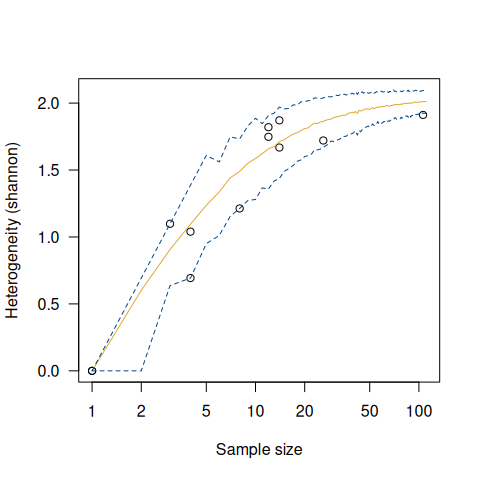

<!-- README.md is generated from README.Rmd. Please edit that file -->

# tabula 

<!-- badges: start -->

[](https://github.com/tesselle/tabula/actions)
[](https://codecov.io/gh/tesselle/tabula)

[](https://cran.r-project.org/package=tabula)
[](https://cran.r-project.org/web/checks/check_results_tabula.html)
[](https://cran.r-project.org/package=tabula)

[](https://www.repostatus.org/#active)

[](https://doi.org/10.5281/zenodo.1489944)
[](https://doi.org/10.21105/joss.01821)
<!-- badges: end -->

## Overview

An easy way to examine archaeological count data. **tabula** provides a
convenient and reproducible toolkit for relative dating by matrix
seriation (reciprocal ranking, CA-based seriation). This package
provides several tests and measures of diversity: heterogeneity and
evenness (Brillouin, Shannon, Simpson, etc.), richness and rarefaction
(Chao1, Chao2, ACE, ICE, etc.), turnover and similarity
(Brainerd-Robinson, etc.). The package make it easy to visualize count
data and statistical thresholds: rank vs. abundance plots, heatmaps,
Ford (1962) and Bertin (1977) diagrams.

    #> 
    #> To cite tabula in publications use:
    #> 
    #>   Frerebeau, Nicolas (2019). tabula: An R Package for Analysis,
    #>   Seriation, and Visualization of Archaeological Count Data. Journal of
    #>   Open Source Software, 4(44), 1821. DOI 10.21105/joss.01821.
    #> 
    #> A BibTeX entry for LaTeX users is
    #> 
    #>   @Article{,
    #>     title = {{tabula}: An R Package for Analysis, Seriation, and Visualization of Archaeological Count Data},
    #>     author = {Nicolas Frerebeau},
    #>     year = {2019},
    #>     journal = {Journal of Open Source Software},
    #>     volume = {4},
    #>     number = {44},
    #>     page = {1821},
    #>     doi = {10.21105/joss.01821},
    #>   }

## Installation

You can install the released version of **tabula** from
[CRAN](https://CRAN.R-project.org) with:

``` r
install.packages("tabula")
```

And the development version from [GitHub](https://github.com/) with:

``` r
# install.packages("remotes")
remotes::install_github("tesselle/tabula")
```

## Usage

``` r
## Load packages
library(tabula)

library(folio) # Datasets
library(khroma) # Color scales
library(ggplot2)
library(magrittr)
```

**tabula** uses a set of S4 classes that represent different special
types of matrix. Please refer to the documentation of the
[**arkhe**](https://github.com/tesselle/arkhe) package where these
classes are defined.

*It assumes that you keep your data tidy*: each variable (type/taxa)
must be saved in its own column and each observation (sample/case) must
be saved in its own row.

### Visualization

Several types of graphs are available in **tabula** which uses
[**ggplot2**](https://ggplot2.tidyverse.org) for plotting informations.
This makes it easy to customize diagrams (e.g. using themes and scales).

Bertin or Ford (battleship curve) diagrams can be plotted, with
statistic threshold (including B. Desachy’s
[sériographe](https://doi.org/10.3406/pica.2004.2396)).

``` r
## Bertin matrix with variables scaled to 0-1 and the variable mean as threshold
scale_01 <- function(x) (x - min(x)) / (max(x) - min(x))
mississippi %>%
  as_count() %>%
  plot_bertin(threshold = mean, scale = scale_01) +
  khroma::scale_fill_vibrant(name = "Mean")
```


``` r
## Ford diagram
mississippi %>%
  as_count() %>%
  plot_ford()
```


Spot matrix[1] allows direct examination of data:

``` r
## Plot co-occurrence of types
## (i.e. how many times (percent) each pairs of taxa occur together 
## in at least one sample.)
mississippi %>%
  as_occurrence() %>%
  plot_spot() +
  ggplot2::labs(size = "Co-occurrence", colour = "Co-occurrence") +
  khroma::scale_colour_YlOrBr()
```


### Seriation

``` r
## Build an incidence matrix with random data
set.seed(12345)
binary <- sample(0:1, 400, TRUE, c(0.6, 0.4))
incidence <- IncidenceMatrix(data = binary, nrow = 20)

## Get seriation order on rows and columns
## Correspondance analysis-based seriation
(indices <- seriate_rank(incidence, margin = c(1, 2)))
#> <PermutationOrder: reciprocal ranking>
#> Permutation order for matrix seriation:
#> - Row order: 1 4 20 3 9 16 19 10 13 2 11 7 17 5 6 18 14 15 8 12...
#> - Column order: 1 16 9 4 8 14 3 20 13 2 6 18 7 17 5 11 19 12 15 10...

## Permute matrix rows and columns
incidence2 <- permute(incidence, indices)
```

``` r
## Plot matrix
plot_heatmap(incidence) + 
  ggplot2::labs(title = "Original matrix") +
  ggplot2::scale_fill_manual(values = c("TRUE" = "black", "FALSE" = "white"))
plot_heatmap(incidence2) + 
  ggplot2::labs(title = "Rearranged matrix") +
  ggplot2::scale_fill_manual(values = c("TRUE" = "black", "FALSE" = "white"))
```


### Diversity

*Diversity* can be measured according to several indices (referred to as
indices of *heterogeneity* – see `vignette("diversity")`). Corresponding
*evenness* (i.e. a measure of how evenly individuals are distributed
across the sample) can also be computed, as well as *richness* and
*rarefaction*.

``` r
mississippi %>%
  as_count() %>%
  index_heterogeneity(method = "shannon")
#> <HeterogeneityIndex: shannon>
#>             size     index
#> 10-P-1       153 1.2027955
#> 11-N-9       758 0.7646565
#> 11-N-1      1303 0.9293974
#> 11-O-10      638 0.8228576
#> 11-N-4      1266 0.7901428
#> 13-N-5        79 0.9998430
#> 13-N-4       241 1.2051989
#> 13-N-16      171 1.1776226
#> 13-O-11      128 1.1533432
#> 13-O-10      226 1.2884172
#> 13-P-1       360 1.1725355
#> 13-P-8       192 1.5296294
#> 13-P-10       91 1.7952443
#> 13-O-7      1233 1.1627477
#> 13-O-5      1709 1.0718463
#> 13-N-21      614 0.9205717
#> 12-O-5       424 1.1751002
#> Holden Lake  360 0.7307620
#> 13-N-15     1300 1.1270126
#> 12-N-3       983 1.0270291
```

``` r
## Data from Conkey 1980, Kintigh 1989, p. 28
chevelon <- as_count(chevelon)

sim_heterogeneity <- simulate_heterogeneity(chevelon, method = "shannon")
plot(sim_heterogeneity) +
  ggplot2::theme_bw() +
  ggplot2::theme(legend.position = "bottom")

sim_richness <- simulate_richness(chevelon, method = "none")
plot(sim_richness) +
  ggplot2::theme_bw() +
  ggplot2::theme(legend.position = "bottom")
```



Several methods can be used to ascertain the degree of *turnover* in
taxa composition along a gradient on qualitative (presence/absence)
data. It assumes that the order of the matrix rows (from *1* to *n*)
follows the progression along the gradient/transect.

Diversity can also be measured by addressing *similarity* between pairs
of sites:

``` r
## Calculate the Brainerd-Robinson index
## Plot the similarity matrix
mississippi %>%
  as_count() %>%
  similarity(method = "brainerd") %>%
  plot_spot() +
  khroma::scale_colour_iridescent(name = "brainerd")
```


## Contributing

Please note that the **tabula** project is released with a [Contributor
Code of Conduct](https://www.tesselle.org/conduct.html). By contributing
to this project, you agree to abide by its terms.

[1] Adapted from Dan Gopstein’s original
[idea](https://dgopstein.github.io/articles/spot-matrix/).
