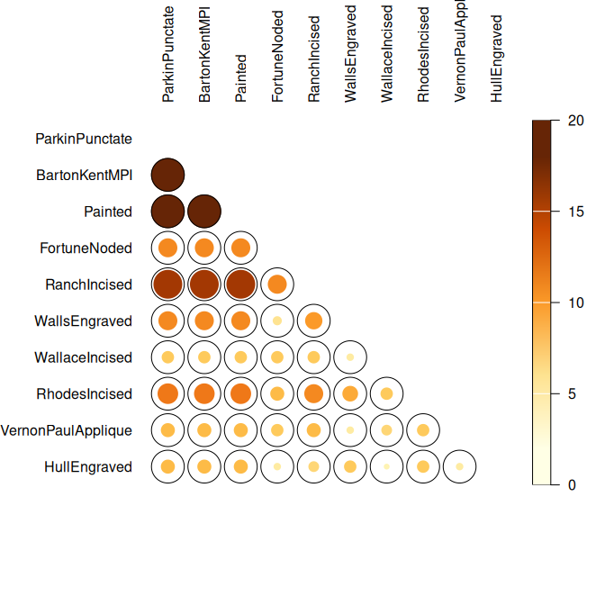
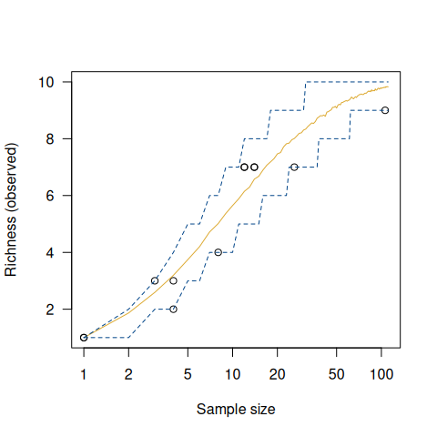

<!-- README.md is generated from README.Rmd. Please edit that file -->

# tabula 

<!-- badges: start -->

[](https://github.com/tesselle/tabula/actions)
[](https://app.codecov.io/gh/tesselle/tabula)
[](https://www.codefactor.io/repository/github/tesselle/tabula)
[](https://cran.r-project.org/package=tabula)

<a href="https://tesselle.r-universe.dev/tabula"
class="pkgdown-devel"></a>
<a href="https://cran.r-project.org/package=tabula"
class="pkgdown-release"></a> <a
href="https://cran.r-project.org/web/checks/check_results_tabula.html"
class="pkgdown-release"></a>
<a href="https://cran.r-project.org/package=tabula"
class="pkgdown-release"></a>

[](https://www.repostatus.org/#active)

[](https://doi.org/10.5281/zenodo.1489944)
[](https://doi.org/10.21105/joss.01821)
<!-- badges: end -->

## Overview

An easy way to examine archaeological count data. This package provides
several tests and measures of diversity: heterogeneity and evenness
(Brillouin, Shannon, Simpson, etc.), richness and rarefaction (Chao1,
Chao2, ACE, ICE, etc.), turnover and similarity (Brainerd-Robinson,
etc.). It allows to easily visualize count data and statistical
thresholds: rank vs. abundance plots, heatmaps, Ford (1962) and Bertin
(1977) diagrams, etc. **tabula** provides methods for:

- Diversity measurement: `heterogeneity()`, `evenness()`, `richness()`,
  `rarefaction()`, `turnover()`.
- Similarity measurement and co-occurrence: `similarity()`,
  `occurrence()`.
- Assessing sample size and significance: `bootstrap()`, `jackknife()`,
  `simulate()`.
- Bertin (1977) or Ford (1962) (battleship curve) diagrams:
  `plot_bertin()`, `plot_ford()`.
- Seriograph (Desachy 2004): `seriograph()`, `matrigraph()`.
- Heatmaps: `plot_heatmap()`, `plot_spot()`.

[**kairos**](https://packages.tesselle.org/kairos/) is a companion
package to **tabula** that provides functions for chronological modeling
and dating of archaeological assemblages from count data.

------------------------------------------------------------------------

To cite tabula in publications use:

Frerebeau N (2019). “tabula: An R Package for Analysis, Seriation, and
Visualization of Archaeological Count Data.” *Journal of Open Source
Software*, *4*(44). <doi:10.21105/joss.01821>
<https://doi.org/10.21105/joss.01821>.

Frerebeau N (2024). *tabula: Analysis and Visualization of
Archaeological Count Data*. Université Bordeaux Montaigne, Pessac,
France. <doi:10.5281/zenodo.1489944>
<https://doi.org/10.5281/zenodo.1489944>, R package version 3.1.0,
<https://packages.tesselle.org/tabula/>.

This package is a part of the tesselle project
<https://www.tesselle.org>.

## Installation

You can install the released version of **tabula** from
[CRAN](https://CRAN.R-project.org) with:

``` r
install.packages("tabula")
```

And the development version from [GitHub](https://github.com/) with:

``` r
# install.packages("remotes")
remotes::install_github("tesselle/tabula")
```

## Usage

``` r
## Install extra packages (if needed)
# install.packages("folio")

## Load packages
library(tabula)
```

*It assumes that you keep your data tidy*: each variable (type/taxa)
must be saved in its own column and each observation (sample/case) must
be saved in its own row.

``` r
## Data from Lipo et al. 2015
data("mississippi", package = "folio")

## Ford diagram
plot_ford(mississippi)
```


``` r
## Co-occurrence of ceramic types
mississippi |> 
  occurrence() |> 
  plot_spot()
```



``` r
## Data from Conkey 1980, Kintigh 1989, p. 28
data("chevelon", package = "folio")

## Measure diversity by comparing to simulated assemblages
set.seed(12345)

chevelon |>
  heterogeneity(method = "shannon") |>
  simulate() |>
  plot()

chevelon |>
  richness(method = "count") |>
  simulate() |>
  plot()
```



## Contributing

Please note that the **tabula** project is released with a [Contributor
Code of Conduct](https://www.tesselle.org/conduct.html). By contributing
to this project, you agree to abide by its terms.

## References

<div id="refs" class="references csl-bib-body hanging-indent"
entry-spacing="0">

<div id="ref-bertin1977" class="csl-entry">

Bertin, Jacques. 1977. *La graphique et le traitement graphique de
l’information*. Nouvelle bibliothèque scientifique. Paris: Flammarion.

</div>

<div id="ref-desachy2004" class="csl-entry">

Desachy, B. 2004. “Le sériographe EPPM: un outil informatisé de
sériation graphique pour tableaux de comptages.” *Revue archéologique de
Picardie* 3 (1): 39–56. <https://doi.org/10.3406/pica.2004.2396>.

</div>

<div id="ref-ford1962" class="csl-entry">

Ford, J. A. 1962. *A Quantitative Method for Deriving Cultural
Chronology*. Technical Manual 1. Washington, DC: Pan American Union.

</div>

</div>
