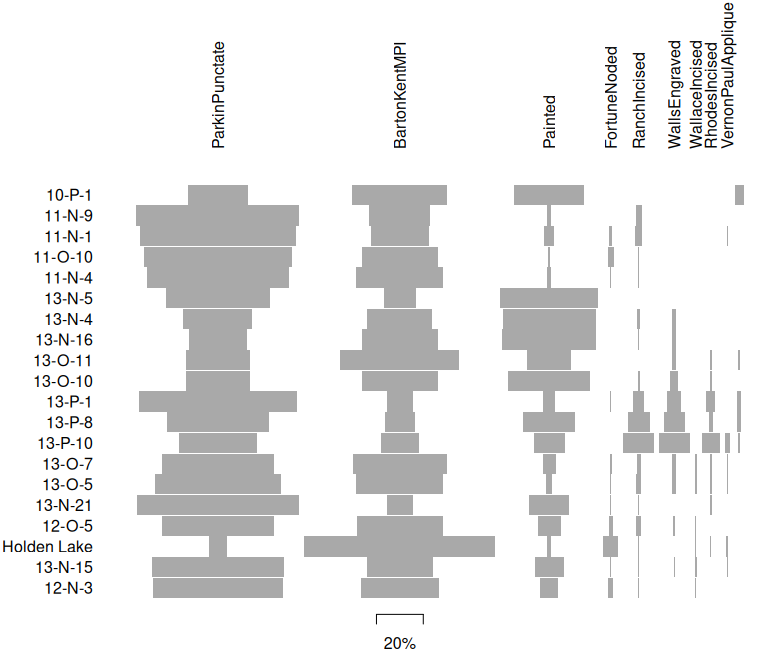

<!-- README.md is generated from README.Rmd. Please edit that file -->

# tabula 

<!-- badges: start -->

[](https://github.com/tesselle/tabula/actions)
[](https://app.codecov.io/gh/tesselle/tabula)
[](https://www.codefactor.io/repository/github/tesselle/tabula)
[](https://cran.r-project.org/package=tabula)

<a href="https://tesselle.r-universe.dev/tabula"
class="pkgdown-devel"></a>
<a href="https://cran.r-project.org/package=tabula"
class="pkgdown-release"></a> <a
href="https://cran.r-project.org/web/checks/check_results_tabula.html"
class="pkgdown-release"></a>
<a href="https://cran.r-project.org/package=tabula"
class="pkgdown-release"></a>

[](https://www.repostatus.org/#active)

[](https://doi.org/10.5281/zenodo.1489944)
[](https://doi.org/10.21105/joss.01821)
<!-- badges: end -->

## Overview

An easy way to examine archaeological count data. This package provides
several tests and measures of diversity: heterogeneity and evenness
(Brillouin, Shannon, Simpson, etc.), richness and rarefaction (Chao1,
Chao2, ACE, ICE, etc.), turnover and similarity (Brainerd-Robinson,
etc.). It allows to easily visualize count data and statistical
thresholds: rank vs. abundance plots, heatmaps, Ford (1962) and Bertin
(1977) diagrams, etc. **tabula** provides methods for:

- Diversity measurement: `heterogeneity()`, `evenness()`, `richness()`,
  `rarefaction()`, `turnover()`.
- Similarity measurement and co-occurrence: `similarity()`,
  `occurrence()`.
- Assessing sample size and significance: `bootstrap()`, `jackknife()`,
  `simulate()`.
- Bertin (1977) or Ford (1962) (battleship curve) diagrams:
  `plot_bertin()`, `plot_ford()`.
- Seriograph (Desachy 2004): `seriograph()`, `matrigraph()`.
- Heatmaps: `plot_heatmap()`, `plot_spot()`.

[**kairos**](https://packages.tesselle.org/kairos/) is a companion
package to **tabula** that provides functions for chronological modeling
and dating of archaeological assemblages from count data.

------------------------------------------------------------------------

To cite tabula in publications use:

Frerebeau N (2019). “tabula: An R Package for Analysis, Seriation, and
Visualization of Archaeological Count Data.” *Journal of Open Source
Software*, *4*(44). <doi:10.21105/joss.01821>
<https://doi.org/10.21105/joss.01821>.

Frerebeau N (2025). *tabula: Analysis and Visualization of
Archaeological Count Data*. Université Bordeaux Montaigne, Pessac,
France. <doi:10.5281/zenodo.1489944>
<https://doi.org/10.5281/zenodo.1489944>, R package version 3.2.0,
<https://packages.tesselle.org/tabula/>.

This package is a part of the tesselle project
<https://www.tesselle.org>.

## Installation

You can install the released version of **tabula** from
[CRAN](https://CRAN.R-project.org) with:

``` r
install.packages("tabula")
```

And the development version from [GitHub](https://github.com/) with:

``` r
# install.packages("remotes")
remotes::install_github("tesselle/tabula")
```

## Usage

``` r
## Install extra packages (if needed)
# install.packages("folio")

## Load the package
library(tabula)
```

*It assumes that you keep your data tidy*: each variable (type/taxa)
must be saved in its own column and each observation (sample/case) must
be saved in its own row.

``` r
## Data from Lipo et al. 2015
data("mississippi", package = "folio")

## Ford diagram
plot_ford(mississippi)
```



``` r
## Co-occurrence of ceramic types
mississippi |> 
  occurrence() |> 
  plot_spot()
```


``` r
## Data from Conkey 1980, Kintigh 1989, p. 28
data("chevelon", package = "folio")

## Measure diversity by comparing to simulated assemblages
set.seed(12345)

chevelon |>
  heterogeneity(method = "shannon") |>
  simulate() |>
  plot()

chevelon |>
  richness(method = "count") |>
  simulate() |>
  plot()
```


## Translation

This package provides translations of user-facing communications, like
messages, warnings and errors, and graphical elements (axis labels). The
preferred language is by default taken from the locale. This can be
overridden by setting of the environment variable `LANGUAGE` (you only
need to do this once per session):

``` r
Sys.setenv(LANGUAGE = "<language code>")
```

Languages currently available are English (`en`) and French (`fr`).

## Contributing

Please note that the **tabula** project is released with a [Contributor
Code of Conduct](https://www.tesselle.org/conduct.html). By contributing
to this project, you agree to abide by its terms.

## References

<div id="refs" class="references csl-bib-body hanging-indent"
entry-spacing="0">

<div id="ref-alroy2018" class="csl-entry">

Alroy, John. 2018. “Limits to Species Richness in Terrestrial
Communities.” Edited by Eric Seabloom. *Ecology Letters* 21 (12):
1781–89. <https://doi.org/10.1111/ele.13152>.

</div>

<div id="ref-baxter2001" class="csl-entry">

Baxter, M. J. 2001. “Methodological Issues in the Study of Assemblage
Diversity.” *American Antiquity* 66 (4): 715–25.
<https://doi.org/10.2307/2694184>.

</div>

<div id="ref-berger1970" class="csl-entry">

Berger, W. H., and F. L. Parker. 1970. “Diversity of Planktonic
Foraminifera in Deep Sea Sediments.” *Science* 168 (3937): 1345–47.
<https://doi.org/10.1126/science.168.3937.1345>.

</div>

<div id="ref-bertin1977" class="csl-entry">

Bertin, Jacques. 1977. *La graphique et le traitement graphique de
l’information*. Nouvelle bibliothèque scientifique. Paris: Flammarion.

</div>

<div id="ref-bobrowsky1989" class="csl-entry">

Bobrowsky, P. T., and B. F. Ball. 1989. “The Theory and Mechanics of
Ecological Diversity in Archaeology.” In *Quantifying Diversity in
Archaeology*, edited by R. D. Leonard and G. T. Jones, 4–12. New
Directions in Archaeology. Cambridge: Cambridge University Press.

</div>

<div id="ref-boone1987" class="csl-entry">

Boone, James L. 1987. “Defining and Measuring Midden Catchment.”
*American Antiquity* 52 (2): 336–45. <https://doi.org/10.2307/281785>.

</div>

<div id="ref-bowman1971" class="csl-entry">

Bowman, K. O., K. Hutcheson, E. P. Odum, and L. R. Shenton. 1971.
“Comments on the Distribution of Indices of Diversity.” In *Statistical
Ecology*, edited by E. C. Patil, E. C. Pielou, and W. E. Waters,
3:315–66. University Park, PA: Pennsylvania State University Press.

</div>

<div id="ref-brainerd1951" class="csl-entry">

Brainerd, G. W. 1951. “The Place of Chronological Ordering in
Archaeological Analysis.” *American Antiquity* 16 (4): 301–13.
<https://doi.org/10.2307/276979>.

</div>

<div id="ref-bray1957" class="csl-entry">

Bray, J. R., and J. T. Curtis. 1957. “An Ordination of the Upland Forest
Communities of Southern Wisconsin.” *Ecological Monographs* 27 (4):
325–49. <https://doi.org/10.2307/1942268>.

</div>

<div id="ref-brillouin1956" class="csl-entry">

Brillouin, L. 1956. *Science and Information Theory*. New York: Academic
Press.

</div>

<div id="ref-buzas1998" class="csl-entry">

Buzas, M. A., and L.-A. C. Hayek. 1998. “SHE Analysis for Biofacies
Identification.” *Journal of Foraminiferal Research* 28 (3): 233–39.

</div>

<div id="ref-decaprariis1976" class="csl-entry">

Caprariis, P. de, R. H. Lindemann, and C. M. Collins. 1976. “A Method
for Determining Optimum Sample Size in Species Diversity Studies.”
*Journal of the International Association for Mathematical Geology* 8
(5): 575–81. <https://doi.org/10.1007/BF01042995>.

</div>

<div id="ref-chao1984" class="csl-entry">

Chao, A. 1984. “Nonparametric Estimation of the Number of Classes in a
Population.” *Scandinavian Journal of Statistics* 11 (4): 265–70.

</div>

<div id="ref-chao1987" class="csl-entry">

———. 1987. “Estimating the Population Size for Capture Recapture Data
with Unequal Catchability.” *Biometrics* 43 (4): 783–91.
<https://doi.org/10.2307/2531532>.

</div>

<div id="ref-chao2016" class="csl-entry">

Chao, A., and C.-H. Chiu. 2016. “Species Richness: Estimation and
Comparison.” In *Wiley StatsRef: Statistics Reference Online*, edited by
N. Balakrishnan, T. Colton, B. Everitt, W. Piegorsch, F. Ruggeri, and J.
L. Teugels, 1–26. Chichester, UK: John Wiley & Sons, Ltd.
<https://doi.org/10.1002/9781118445112.stat03432.pub2>.

</div>

<div id="ref-chao1992" class="csl-entry">

Chao, A., and S.-M. Lee. 1992. “Estimating the Number of Classes Via
Sample Coverage.” *Journal of the American Statistical Association* 87
(417): 210–17. <https://doi.org/10.1080/01621459.1992.10475194>.

</div>

<div id="ref-chiu2014" class="csl-entry">

Chiu, C.-H., Y.-T. Wang, B. A. Walther, and A. Chao. 2014. “An Improved
Nonparametric Lower Bound of Species Richness Via a Modified Good-Turing
Frequency Formula.” *Biometrics* 70 (3): 671–82.
<https://doi.org/10.1111/biom.12200>.

</div>

<div id="ref-cody1975" class="csl-entry">

Cody, M. L. 1975. “Towards a Theory of Continental Species Diversity:
Bird Distributions Over Mediterranean Habitat Gradients.” In *Ecology
and Evolution of Communities*, edited by M. L. Cody and J. M. Diamond,
214–57. Cambridge, MA: Harvard University Press.

</div>

<div id="ref-conkey1980" class="csl-entry">

Conkey, Margaret W. 1980. “The Identification of Prehistoric
Hunter-Gatherer Aggregation Sites: The Case of Altamira.” *Current
Anthropology* 21 (5): 609–30.
<https://escholarship.org/uc/item/0q29504g>.

</div>

<div id="ref-desachy2004" class="csl-entry">

Desachy, B. 2004. “Le sériographe EPPM: un outil informatisé de
sériation graphique pour tableaux de comptages.” *Revue archéologique de
Picardie* 3 (1): 39–56. <https://doi.org/10.3406/pica.2004.2396>.

</div>

<div id="ref-dice1936" class="csl-entry">

Dice, L. R., and H. J. Leraas. 1936. “A Graphic Method for Comparing
Several Sets of Measurements.” *Contributions from the Laboratory of
Vertebrate Genetics* 3: 1–3.

</div>

<div id="ref-eren2012" class="csl-entry">

Eren, Metin I., Anne Chao, Wen-Han Hwang, and Robert K. Colwell. 2012.
“Estimating the Richness of a Population When the Maximum Number of
Classes Is Fixed: A Nonparametric Solution to an Archaeological
Problem.” Edited by Alex Mesoudi. *PLoS ONE* 7 (5): e34179.
<https://doi.org/10.1371/journal.pone.0034179>.

</div>

<div id="ref-fisher1943" class="csl-entry">

Fisher, R. A., A. S. Corbet, and C. B. Williams. 1943. “The Relation
Between the Number of Species and the Number of Individuals in a Random
Sample of an Animal Population.” *The Journal of Animal Ecology* 12 (1):
42. <https://doi.org/10.2307/1411>.

</div>

<div id="ref-ford1962" class="csl-entry">

Ford, J. A. 1962. *A Quantitative Method for Deriving Cultural
Chronology*. Technical Manual 1. Washington, DC: Pan American Union.

</div>

<div id="ref-frerebeau2019" class="csl-entry">

Frerebeau, Nicolas. 2019. “Tabula: An R Package for Analysis, Seriation,
and Visualization of Archaeological Count Data.” *Journal of Open Source
Software* 4 (44): 1821. <https://doi.org/10.21105/joss.01821>.

</div>

<div id="ref-gleason1922" class="csl-entry">

Gleason, H. A. 1922. “On the Relation Between Species and Area.”
*Ecology* 3 (2): 158–62. <https://doi.org/10.2307/1929150>.

</div>

<div id="ref-gotelli2011" class="csl-entry">

Gotelli, Nicholas J., and Robert K. Colwell. 2011. “Estimating Species
Richness.” In *Biological Diversity: Frontiers in Measurement and
Assessment*, edited by Anne E. Magurran and Brian J. McGill, 39–54.
Oxford: Oxford University Press.

</div>

<div id="ref-hayek2010" class="csl-entry">

Hayek, L.-A. C., and M. A. Buzas. 2010. *Surveying Natural Populations:
Quantitative Tools for Assessing Biodiversity*. Second edition. New
York: Columbia University Press.

</div>

<div id="ref-hubbs1953" class="csl-entry">

Hubbs, C. L., and C. Hubbs. 1953. “An Improved Graphical Analysis and
Comparison of Series of Samples.” *Systematic Biology* 2 (2): 49–56.
<https://doi.org/10.2307/sysbio/2.2.49>.

</div>

<div id="ref-huntley2004" class="csl-entry">

Huntley, Deborah L. 2004. “Interaction, Boundaries, and Identities: A
Multiscalar Approach to the Organizational Scale of Pueblo IV Zuni
Society.” PhD thesis, Arizona State University.

</div>

<div id="ref-huntley2008" class="csl-entry">

———. 2008. *Ancestral Zuni Glaze-Decorated Pottery: Viewing Pueblo IV
Regional Organization Through Ceramic Production and Exchange*.
Anthropological Papers of the University of Arizona 72. Tucson:
University of Arizona Press. <https://doi.org/10.2307/j.ctv2ngx5n8>.

</div>

<div id="ref-hurlbert1971" class="csl-entry">

Hurlbert, S. H. 1971. “The Nonconcept of Species Diversity: A Critique
and Alternative Parameters.” *Ecology* 52 (4): 577–86.
<https://doi.org/10.2307/1934145>.

</div>

<div id="ref-hutcheson1970" class="csl-entry">

Hutcheson, K. 1970. “A Test for Comparing Diversity Based on the Shannon
Formula.” *Journal of Theoretical Biology* 29 (1): 151–54.
<https://doi.org/10.1016/0022-5193(70)90124-4>.

</div>

<div id="ref-kilburn1966" class="csl-entry">

Kilburn, P. D. 1966. “Analysis of the Species-Area Relation.” *Ecology*
47 (5): 831–43. <https://doi.org/10.2307/1934269>.

</div>

<div id="ref-kintigh2006" class="csl-entry">

Kintigh, K. 2006. “Ceramic Dating and Type Associations.” In *Managing
Archaeological Data: Essays in Honor of Sylvia W. Gaines*, edited by J.
Hantman and R. Most, 17–26. Anthropological Research Paper 57. Tempe,
AZ: Arizona State University. <https://doi.org/10.6067/XCV8J38QSS>.

</div>

<div id="ref-kintigh1984" class="csl-entry">

Kintigh, K. W. 1984. “Measuring Archaeological Diversity by Comparison
with Simulated Assemblages.” *American Antiquity* 49 (1): 44–54.
<https://doi.org/10.2307/280511>.

</div>

<div id="ref-kintigh1989" class="csl-entry">

———. 1989. “Sample Size, Significance, and Measures of Diversity.” In
*Quantifying Diversity in Archaeology*, edited by R. D. Leonard and G.
T. Jones, 25–36. New Directions in Archaeology. Cambridge: Cambridge
University Press.

</div>

<div id="ref-laxton1978" class="csl-entry">

Laxton, R. R. 1978. “The Measure of Diversity.” *Journal of Theoretical
Biology* 70 (1): 51–67. <https://doi.org/10.1016/0022-5193(78)90302-8>.

</div>

<div id="ref-leonard1989" class="csl-entry">

Leonard, Robert D., and George T. Jones, eds. 1989. *Quantifying
Diversity in Archaeology*. New Directions in Archaeology. Cambridge:
Cambridge University Press.

</div>

<div id="ref-macarthur1965" class="csl-entry">

Macarthur, R. H. 1965. “Patterns of Species Diversity.” *Biological
Reviews* 40 (4): 510–33.
<https://doi.org/10.1111/j.1469-185X.1965.tb00815.x>.

</div>

<div id="ref-magurran1988" class="csl-entry">

Magurran, A. E. 1988. *Ecological Diversity and Its Measurement*.
Princeton, NJ: Princeton University Press.

</div>

<div id="ref-magurran2011" class="csl-entry">

Magurran, A. E., and B. J. McGill, eds. 2011. *Biological Diversity:
Frontiers in Measurement and Assessment*. Oxford: Oxford University
Press.

</div>

<div id="ref-margalef1958" class="csl-entry">

Margalef, R. 1958. “Information Theory in Ecology.” *General Systems* 3:
36–71.

</div>

<div id="ref-mcintosh1967" class="csl-entry">

McIntosh, R. P. 1967. “An Index of Diversity and the Relation of Certain
Concepts to Diversity.” *Ecology* 48 (3): 392–404.
<https://doi.org/10.2307/1932674>.

</div>

<div id="ref-menhinick1964" class="csl-entry">

Menhinick, E. F. 1964. “A Comparison of Some Species-Individuals
Diversity Indices Applied to Samples of Field Insects.” *Ecology* 45
(4): 859–61. <https://doi.org/10.2307/1934933>.

</div>

<div id="ref-moreno2010" class="csl-entry">

Moreno, C. E., and P. Rodríguez. 2010. “A Consistent Terminology for
Quantifying Species Diversity?” *Oecologia* 163 (2): 279–82.
<https://doi.org/10.1007/s00442-010-1591-7>.

</div>

<div id="ref-odum1960" class="csl-entry">

Odum, H. T., J. E. Cantlon, and L. S. Kornicker. 1960. “An
Organizational Hierarchy Postulate for the Interpretation of
Species-Individual Distributions, Species Entropy, Ecosystem Evolution,
and the Meaning of a Species-Variety Index.” *Ecology* 41 (2): 395–95.
<https://doi.org/10.2307/1930248>.

</div>

<div id="ref-peet1974" class="csl-entry">

Peet, R. K. 1974. “The Measurement of Species Diversity.” *Annual Review
of Ecology and Systematics* 5 (1): 285–307.
<https://doi.org/10.1146/annurev.es.05.110174.001441>.

</div>

<div id="ref-pielou1975" class="csl-entry">

Pielou, E. C. 1975. *Ecological Diversity*. New York: Wiley.

</div>

<div id="ref-preston1948" class="csl-entry">

Preston, F. W. 1948. “The Commonness, and Rarity, of Species.” *Ecology*
29 (3): 254–83. <https://doi.org/10.2307/1930989>.

</div>

<div id="ref-preston1962" class="csl-entry">

———. 1962a. “The Canonical Distribution of Commonness and Rarity: Part
I.” *Ecology* 43 (2): 185. <https://doi.org/10.2307/1931976>.

</div>

<div id="ref-preston1962a" class="csl-entry">

———. 1962b. “The Canonical Distribution of Commonness and Rarity: Part
II.” *Ecology* 43 (3): 410–32. <https://doi.org/10.2307/1933371>.

</div>

<div id="ref-robinson1951" class="csl-entry">

Robinson, W. S. 1951. “A Method for Chronologically Ordering
Archaeological Deposits.” *American Antiquity* 16 (4): 293–301.
<https://doi.org/10.2307/276978>.

</div>

<div id="ref-routledge1977" class="csl-entry">

Routledge, R. D. 1977. “On Whittaker’s Components of Diversity.”
*Ecology* 58 (5): 1120–27. <https://doi.org/10.2307/1936932>.

</div>

<div id="ref-sander1968" class="csl-entry">

Sander, H. L. 1968. “Marine Benthic Diversity: A Comparative Study.”
*The American Naturalist* 102 (925): 243–82.
<https://www.jstor.org/stable/2459027>.

</div>

<div id="ref-shannon1948" class="csl-entry">

Shannon, C. E. 1948. “A Mathematical Theory of Communication.” *The Bell
System Technical Journal* 27: 379–423.
<https://doi.org/10.1002/j.1538-7305.1948.tb01338.x>.

</div>

<div id="ref-simpson1949" class="csl-entry">

Simpson, E. H. 1949. “Measurement of Diversity.” *Nature* 163 (4148):
688–88. <https://doi.org/10.1038/163688a0>.

</div>

<div id="ref-simpson1960" class="csl-entry">

Simpson, Georges Gaylord, Anne Roe, and Richard C. Lewontin. 1960.
*Quantitative Zoology*. Édition revue. New York: Harcourt, Brace and
Company.

</div>

<div id="ref-tothmeresz1995" class="csl-entry">

Tóthmérész, B. 1995. “Comparison of Different Methods for Diversity
Ordering.” *Journal of Vegetation Science* 6 (2): 283–90.
<https://doi.org/10.2307/3236223>.

</div>

<div id="ref-whittaker1960" class="csl-entry">

Whittaker, R. H. 1960. “Vegetation of the Siskiyou Mountains, Oregon and
California.” *Ecological Monographs* 30 (3): 279–338.
<https://doi.org/10.2307/1943563>.

</div>

<div id="ref-wilson1984" class="csl-entry">

Wilson, M. V., and A. Shmida. 1984. “Measuring Beta Diversity with
Presence-Absence Data.” *The Journal of Ecology* 72 (3): 1055–64.
<https://doi.org/10.2307/2259551>.

</div>

</div>
