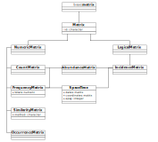

```{r setup, include = FALSE, echo=FALSE}
knitr::opts_chunk$set(
  collapse = TRUE,
  comment = "#>"
)
```

# Definitions
The **tabula** package provides a set of S4 classes for archaeological data matrices that extend the basic `matrix` data type. These new classes represent different special types of matrix.

* Numeric matrix:
  * `CountMatrix` represents count data,
  * `FrequencyMatrix` represents relative frequency data.
  * `OccurrenceMatrix` represents a co-occurrence matrix.
  * `SimilarityMatrix` represents a (dis)similarity matrix.
* Logical matrix:
  * `IncidenceMatrix` represents presence/absence data.
    
*It assumes that you keep your data tidy*: each variable (taxon/type) must be saved in its own column and each observation (assemblage/sample/case) must be saved in its own row. Note that missing values are not allowed.

Methods for a variety of functions applied to objects from these classes provide tools for analysis, seriation and dating of archaeological assemblages. See `help(methods)` to list all available methods for these classes.

The internal structure of S4 classes implemented in **tabula** is depicted in the UML class diagram in the following figure.

```{r uml, echo=FALSE, fig.cap="UML class diagram of the S4 classes structure.", fig.width=7}

```

## Numeric matrix
### Count matrix

We denote the $m \times p$ count matrix by $A = \left[ a_{ij} \right] ~\forall i \in \left[ 1,m \right], j \in \left[ 1,p \right]$ with row and column sums:

\begin{align}
 a_{i \cdot} = \sum_{j = 1}^{p} a_{ij} &&
 a_{\cdot j} = \sum_{i = 1}^{m} a_{ij} &&
 a_{\cdot \cdot} = \sum_{i = 1}^{m} \sum_{j = 1}^{p} a_{ij} &&
 \forall a_{ij} \in \mathbb{N}
\end{align}

### Frequency matrix

A frequency matrix represents relative abundances.

We denote the $m \times p$ frequency matrix by $B = \left[ b_{ij} \right] ~\forall i \in \left[ 1,m \right], j \in \left[ 1,p \right]$ with row and column sums:

\begin{align}
 b_{i \cdot} = \sum_{j = 1}^{p} b_{ij} = 1 &&
 b_{\cdot j} = \sum_{i = 1}^{m} b_{ij} &&
 b_{\cdot \cdot} = \sum_{i = 1}^{m} \sum_{j = 1}^{p} b_{ij} &&
 \forall b_{ij} \in \left[ 0,1 \right]
\end{align}

### Co-occurrence matrix

A co-occurrence matrix is a symmetric matrix with zeros on its main diagonal, which works out how many times (expressed in percent) each pairs of taxa occur together in at least one sample.

The $p \times p$ co-occurrence matrix $D = \left[ d_{i,j} \right] ~\forall i,j \in \left[ 1,p \right]$ is defined over an $m \times p$ abundance matrix $A = \left[ a_{x,y} \right] ~\forall x \in \left[ 1,m \right], y \in \left[ 1,p \right]$ as:

$$ d_{i,j} = \sum_{x = 1}^{m} \bigcap_{y = i}^{j} a_{xy} $$

with row and column sums:

\begin{align}
  d_{i \cdot} = \sum_{j \geqslant i}^{p} d_{ij} &&
  d_{\cdot j} = \sum_{i \leqslant j}^{p} d_{ij} &&
  d_{\cdot \cdot} = \sum_{i = 1}^{p} \sum_{j \geqslant i}^{p} d_{ij} &&
  \forall d_{ij} \in \mathbb{N}
\end{align}

## Logical matrix
### Incidence matrix

We denote the $m \times p$ incidence matrix by $C = \left[ c_{ij} \right] ~\forall i \in \left[ 1,m \right], j \in \left[ 1,p \right]$ with row and column sums:

\begin{align}
 c_{i \cdot} = \sum_{j = 1}^{p} c_{ij} &&
 c_{\cdot j} = \sum_{i = 1}^{m} c_{ij} &&
 c_{\cdot \cdot} = \sum_{i = 1}^{m} \sum_{j = 1}^{p} c_{ij} &&
 \forall c_{ij} \in \lbrace 0,1 \rbrace
\end{align}

# Usage

```{r packages}
# Load packages
library(tabula)
library(magrittr)
```

## Create

These new classes are of simple use, on the same way as the base `matrix`:

```{r create}
set.seed(12345)
## Create a count data matrix
CountMatrix(data = sample(0:10, 100, TRUE),
            nrow = 10, ncol = 10)

## Create an incidence (presence/absence) matrix
## Numeric values are coerced to logical as by as.logical
IncidenceMatrix(data = sample(0:1, 100, TRUE),
                nrow = 10, ncol = 10)
```

Note that a `FrequencyMatrix` can only be created by coercion (see below).

## Coerce
**tabula** uses coercing mechanisms (with validation methods) for data type conversions:

```{r coerce}
## Create a count matrix
## Numeric values are coerced to integer and hence truncated towards zero
A1 <- CountMatrix(data = sample(0:10, 100, TRUE),
                  nrow = 10, ncol = 10)

## Coerce counts to frequencies
B <- as_frequency(A1)

## Row sums are internally stored before coercing to a frequency matrix
## (use totals() to get these values)
## This allows to restore the source data
A2 <- as_count(B)
all(A1 == A2)

## Coerce to presence/absence
C <- as_incidence(A1)

## Coerce to a co-occurrence matrix
D <- as_occurrence(A1)
```

# Visualization

Several types of graphs are available in **tabula** which uses **ggplot2** for plotting informations. This makes it easy to customize diagrams (e.g. using themes and scales).

## Spot plot
Spot matrix allows direct examination of data (above/below some threshold):

```{r plot-freq, fig.cap="Spot plot", fig.width=4, fig.height=6, fig.align="center"}
## Plot frequencies with the column means as a threshold
mississippi %>%
  as_count() %>%
  plot_spot(threshold = mean) +
  ggplot2::labs(size = "Frequency", colour = "Mean") +
  khroma::scale_colour_vibrant()
```

```{r plot-occ, fig.cap="Spot plot of co-occurrence", fig.width=6, fig.height=4, fig.align="center"}
## Plot co-occurrence of types
## (i.e. how many times (percent) each pairs of taxa occur together 
## in at least one sample.)
mississippi %>%
  as_occurrence() %>%
  plot_spot() +
  ggplot2::labs(size = "", colour = "Co-occurrence") +
  ggplot2::theme(legend.box = "horizontal") +
  khroma::scale_colour_YlOrBr()
```

## Heatmap

Abundance matrix can be displayed as a heatmap of relative abundances (frequency), or as percentages of the independence value (in french, "pourcentages de valeur d'indépendance", PVI).

```{r plot-matrix, fig.cap="Heatmap", fig.width=7, fig.height=3.5, fig.align="center"}
boves %>%
  as_count() %>%
  plot_heatmap() +
  khroma::scale_fill_YlOrBr()
```


PVI is calculated for each cell as the percentage to the column theoretical independence value: PVI greater than $1$ represent positive deviations from the independence, whereas PVI smaller than $1$ represent negative deviations [@desachy2004]. The PVI matrix allows to explore deviations from independence (an intuitive graphical approach to $\chi^2$), in such a way that a high-contrast matrix has quite significant deviations, with a low risk of being due to randomness [@desachy2004].

```{r plot-matrigraphe, fig.cap="Matrigraphe", fig.width=7, fig.height=3.5, fig.align="center"}
## Reproduce B. Desachy's matrigraphe
boves %>%
  as_count() %>%
  plot_heatmap(PVI = TRUE) +
  khroma::scale_fill_BuRd(midpoint = 1)
```

## Bar plot
@bertin1977 or @ford1962 (battleship curve) diagrams can also be plotted, with statistic threshold.

```{r plot-bertin, fig.cap="Bertin diagram", fig.width=7, fig.height=7, fig.align="center"}
mississippi %>%
  as_count() %>%
  plot_bertin(threshold = mean) +
  khroma::scale_fill_bright()
```

```{r plot-ford, fig.cap="Ford diagram", fig.width=7, fig.height=3.5, fig.align="center"}
boves %>%
  as_count() %>%
  plot_ford(EPPM = TRUE) +
  khroma::scale_fill_contrast()
```

# References
